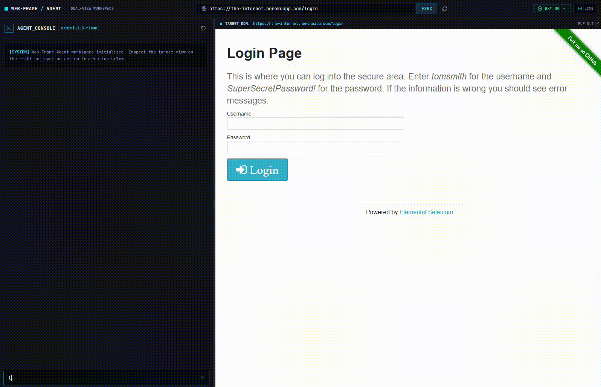
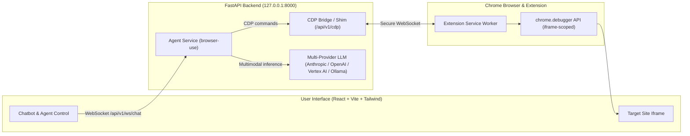

# Web-Frame Agent

[](https://www.python.org/)
[](https://fastapi.tiangolo.com/)
[](https://github.com/browser-use/browser-use)
[](https://react.dev/)
[](https://vitejs.dev/)
[](https://tailwindcss.com/)
[](https://developer.chrome.com/docs/extensions/mv3/intro/)
[](https://langfuse.com/)
[](LICENSE)

**An LLM-driven autonomous web agent that browses inside your own Chrome session — not a headless clone.**

Web-Frame Agent lets an LLM (Anthropic Claude, OpenAI, Google Vertex AI, or a local Ollama model) explore, analyze, and interact with any website through your *real, already-authenticated* browser tab. Instead of spinning up a separate Chromium instance or streaming a video feed from a cloud browser, the target site is rendered directly inside the app's own UI, live, as native DOM — through a bidirectional Chrome DevTools Protocol (CDP) bridge connected to a companion Chrome extension.

<p align="center">
  
</p>

> *Chat on the left tells the agent what to do; the real target page on the right reacts live — no screencast, no separate browser window.*

---

## Why this exists

Most browser-agent tooling today falls into one of two camps:

- **Cloud browser platforms** ([Browserbase](https://www.browserbase.com/), [Anchor Browser](https://anchorbrowser.io/), [browser-use Cloud](https://browser-use.com/)) — you get a live view, but it's a video/screencast of a browser running on someone else's infrastructure, billed by the minute, using a fresh session you have to log into.
- **Local headless/headed automation** (Playwright, Selenium bots) — fast and free, but you're driving a throwaway browser profile, fighting bot detection, and there's nothing for a human to *see* live.

Web-Frame Agent takes a third path: the agent drives **your own Chrome tab**, using **your own logged-in session**, and the target page is embedded as **real, crisp, native DOM** — not a video stream. That means:

- **Zero cloud browser cost** — no per-minute billing, no proxy fleet to dodge bot detection.
- **Native rendering** — selectable text, responsive layout, no video artifacts or lag.
- **Your real session** — no re-authenticating in a disposable cloud browser.
- **Live human co-browsing** — because the target site is a real iframe (not a screencast), a person can click and type directly into it at any time, no explicit "handoff" protocol required.

The trade-off, stated plainly: this relies on deliberately unblocking a site's anti-framing protections (`X-Frame-Options`, `Content-Security-Policy: frame-ancestors`) through a Chrome extension. That's a real and active choice, not a side effect — see [Security & Threat Model](#security--threat-model) below.

---

## Architecture



### Three technical pillars

1. **CDP Bridge Shim** (`/api/v1/cdp`) — emulates the `Target.*` / `Browser.*` domains that Playwright / `browser-use` expect from a real Chromium process, and relays real commands to the extension. No separate browser is ever launched.
2. **Chrome Extension + `chrome.debugger`** — attaches to the user's existing tab in flat-session mode, auto-attaches to the target iframe's OOPIF session, and executes clicks, typing, scrolling, and navigation directly inside it.
3. **Adaptive iframe unlocking** — per-domain rules (declarativeNetRequest header stripping, JS anti-framebusting patches, CHIPS-compliant cookie rewriting) learned and cached automatically, rather than a blanket rule applied to every site.

---

## Quick Start

### Prerequisites

- **Python 3.12+** with [`uv`](https://github.com/astral-sh/uv) (recommended) or `pip`
- **Node.js 20+** with `npm`, or [`bun`](https://bun.sh) (the repo ships a `bun.lock`)
- **Google Chrome**, with Developer Mode enabled to load the extension
- An LLM provider account (Anthropic, OpenAI, or Google Cloud Vertex AI) or a local [Ollama](https://ollama.com/) instance
### 1. Backend

```bash
cd backend
cp .env.example .env
```

Edit `backend/.env`:

```bash
# Target LLM provider: anthropic, openai, vertex, or ollama
LLM_PROVIDER="anthropic"
ANTHROPIC_API_KEY="sk-ant-your-key-here"
# Or configure OPENAI_API_KEY, GOOGLE_CLOUD_PROJECT, or OLLAMA_HOST (see .env.example)
# Required, fail-fast at startup (minimum 16 characters).
# Generate one with: python -c "import secrets; print(secrets.token_urlsafe(32))"
API_TOKEN="your-secure-random-token-here"
```

> The frontend build reads this same `backend/.env` file and fails fast if `API_TOKEN`, `BACKEND_HOST`, or `BACKEND_PORT` are missing.

Install dependencies and start the backend:

```bash
uv run python run.py
# or: python -m uvicorn app.main:app --host 127.0.0.1 --port 8000 --reload
```

The backend starts on `http://127.0.0.1:8000`.

### 2. Chrome Extension

1. Open `chrome://extensions/`
2. Enable **Developer mode** (top right)
3. Click **Load unpacked**
4. Select the repository's `extension/` folder

### 3. Frontend

```bash
cd frontend
npm install
npm run dev
```

Open `http://localhost:5173` in the **same Chrome browser** where the extension is installed.

---
### 4. Multi-Provider LLM Configuration

Web-Frame Agent natively supports multiple LLM backends via a unified decorator with Langfuse tracing and cost enforcement:

- **Anthropic (`LLM_PROVIDER=anthropic`)** — Recommended for autonomous web navigation (`claude-sonnet-5`). Accurately tracks prompt caching reads (10% rate) and cache creation (125% rate) against the task cost kill-switch.
- **OpenAI (`LLM_PROVIDER=openai`)** — Fast and capable with `gpt-5`, `o3`, or `o3-mini`.
- **Google Cloud Vertex AI (`LLM_PROVIDER=vertex`)** — Enterprise-grade Gemini models (`gemini-3.8-flash`, `gemini-3.7-flash`).
- **Ollama (`LLM_PROVIDER=ollama`)** — 100% private and local inference (`qwen3.8:27b`, `qwen3.8:72b`).
  > **Note on Local Models**: Web automation agents require precise tool-calling and JSON structured output. Small local models (< 14B parameters) frequently fail to adhere to action schemas. For reliable autonomous navigation, use function-calling-optimized models with 27B+ parameters (such as `qwen3.8:27b` or larger) or a cloud provider.

## Security & Threat Model

Web-Frame Agent grants an LLM agent real control over a real browser tab. The security model is designed to be **fail-closed by default**, and this section documents honestly what each mechanism actually protects against — not just what it's named after.

| Mechanism | Protects against | Does *not* protect against |
|---|---|---|
| **Extension identity pinning** — the manifest declares a fixed RSA public key, yielding a deterministic extension ID (`ckfcbipidpedpdlijgmhmoapjlnfiaog`); the backend rejects any non-matching origin (`1008 Policy Violation`) | Accidental collisions with unrelated third-party extensions already installed in the user's browser | A deliberate clone: the public key is open-source, so anyone can reproduce the same ID. Real protection against targeted clones comes from the session token below. |
| **Ephemeral session token** (`session_token`) | Targeted impersonation of the official extension. Minted only via loopback with strict `Origin` verification, held in volatile memory only — never written to disk or browser storage | — |
| **Mandatory master `API_TOKEN`** | Direct access to protected endpoints. All sensitive channels require authentication; the frontend mints short-lived derived tickets so the master token is never exposed to the browser bundle or DOM | — |
| **Single-use CDP bootstrap tokens** (30s TTL) | Leakage of the master token through the public CDP discovery endpoints that Playwright/`browser-use` connect to | — |
| **Raw ASGI socket inspection** (not `X-Forwarded-For`) | Header-based IP spoofing on unauthenticated local endpoints | Misconfigured reverse proxies that bypass expected network topology — verify your deployment's network path |
| **Cloud/routable mode gate** (`ALLOW_ROUTABLE_NETWORK`) | Unauthenticated session minting once the backend is reachable off-loopback (e.g. behind an ALB); fails closed (`403`) on missing, empty, or invalid master token | — |
| **Anti-DNS-rebinding** (`Host` header validation) | Forged cross-origin requests targeting the local backend | — |
| **Strict CORS**, **rate limiting** (5 tasks/min/IP), **cost & step kill-switches** ($1.50 / 30 steps per task, default) | Runaway cost, abuse, and cross-origin misuse | — |

**On iframe unblocking specifically:** this project deliberately disables a target site's anti-clickjacking protections (`X-Frame-Options`, CSP `frame-ancestors`) via the extension, and patches JavaScript-level frame-detection checks. This is the mechanism that makes the whole architecture possible, and it is also, by nature, a security-relevant action performed on sites the project does not own. Automating interactions with third-party websites is subject to each service's Terms of Service — see [License & Disclaimer](#license--disclaimer).

---

## Known Limitations

This is an actively developed project, not a finished product. Currently out of scope:

- **No persistence** — task history, chat state, and rate-limit counters live in memory; a backend restart clears them.
- **Single-user, single-task** — one agent session at a time; no horizontal scaling yet.
- **No JS dialog handling** — a synchronous `alert()`/`confirm()`/`prompt()` inside the target page can stall the debugger session.
- **No human/agent co-browsing coordination** — a person and the agent can both act on the live DOM simultaneously, but there is no soft-lock or "who's in control" indicator yet.
- **Iframe-unlocking coverage is not exhaustive** — the adaptive rule cache handles the common cases (HTTP header stripping, `window.top` spoofing, CHIPS cookie rewriting); sites with more aggressive bot-detection or non-standard framebusting may still fail.

See the project roadmap for the full, current status.

---

## License & Disclaimer

Distributed under the [MIT License](LICENSE), for **strictly educational and personal research purposes**.

Automating interactions with third-party websites is subject to each service's Terms of Service. The user assumes full responsibility for how this software is used.